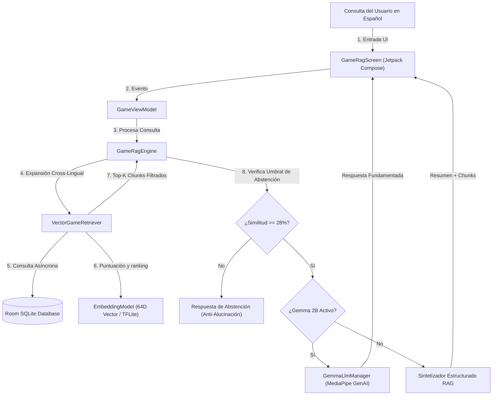
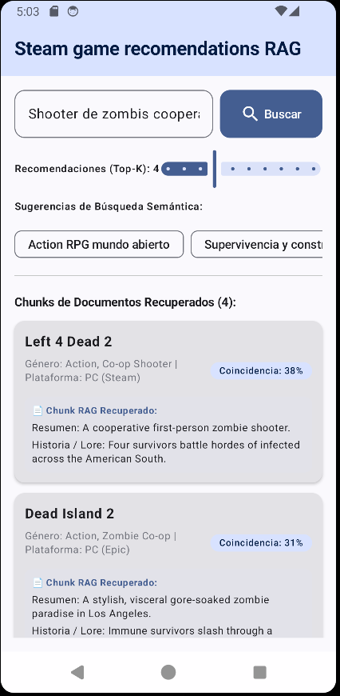

# Sistema RAG de Recomendación de Juegos de Steam para Android 🎮🧠

Este proyecto implementa un sistema de **Generación Aumentada por Recuperación (RAG - Retrieval-Augmented Generation)** completo, moderno y de alto rendimiento en Android utilizando **Jetpack Compose**, **Arquitectura MVVM**, **Base de Datos SQLite (Room)**, **Google MediaPipe Tasks Text / GenAI (Gemma 2B)** y **Embeddings Vectoriales Semánticos On-Device (100% Offline)**.

---

## 📋 Tabla de Contenidos
1. [Visión General del Sistema RAG](#visión-general-del-sistema-rag)
2. [Arquitectura del Sistema (MVVM)](#arquitectura-del-sistema-mvvm)
3. [Corpus de Conocimiento Multi-Documento](#corpus-de-conocimiento-multi-documento)
4. [Capa de Persistencia y Caching (Android Room)](#capa-de-persistencia-y-caching-android-room)
5. [Modelo Vectorial y Normalizador Cross-Lingual (Español / Inglés)](#modelo-vectorial-y-normalizador-cross-lingual-español--inglés)
6. [LLM Local On-Device (Gemma 2B y MediaPipe GenAI)](#llm-local-on-device-gemma-2b-y-mediapipe-genai)
7. [Motor de Recuperación Híbrido y RAG Engine](#motor-de-recuperación-híbrido-y-rag-engine)
8. [Mecanismo de Abstención y Anti-Alucinación](#mecanismo-de-abstención-y-anti-alucinación)
9. [Interfaz de Usuario (Jetpack Compose UI)](#interfaz-de-usuario-jetpack-compose-ui)
10. [Guía Paso a Paso para Probar la Aplicación / APK](#guía-paso-a-paso-para-probar-la-aplicación--apk)

---

## 💡 Visión General del Sistema RAG

El objetivo principal de este sistema RAG es permitir a los usuarios realizar consultas en lenguaje natural en español (ej. *"Action RPG mundo abierto"*, *"supervivencia y construcción submarina"*, *"co-op zombie shooter"*) y obtener respuestas precisas, contextualizadas y fundamentadas estrictamente en el corpus de datos de videojuegos de Steam, evitando cualquier tipo de alucinación.



---

## 🏛 Arquitectura del Sistema (MVVM)

El proyecto sigue estrictamente el patrón arquitectónico recomendado por Google **MVVM (Model-View-ViewModel)**:

- **Model Layer**: 
  - `GameDocument.kt`: Representación del documento/juego y resultado RAG.
  - `GameEntity.kt` / `GameDao.kt` / `GameDatabase.kt`: Capa de persistencia SQLite Room.
  - `EmbeddingModel.kt`: Generador de vectores semánticos, normalización L2 y similitud coseno.
  - `VectorGameRetriever.kt`: Normalización NFD de acentos, mapa de sinónimos español-inglés y buscador vectorial híbrido.
  - `GemmaLlmManager.kt`: Integración de Gemma 2B mediante la API `com.google.mediapipe:tasks-genai`.
  - `GameRagEngine.kt`: Orquestador RAG y sintetizador de respuestas.
- **ViewModel Layer**:
  - `GameViewModel.kt`: Hereda de `AndroidViewModel`, gestiona la inicialización en segundo plano, el valor del deslizador **Top-K**, el estado reactivo (`StateFlow`) y la invocación asíncrona del motor RAG.
- **View Layer**:
  - `GameRagScreen.kt`: Interfaz declarativa construida con Jetpack Compose y Material 3.
  - `MainActivity.kt`: Punto de entrada de la aplicación.

---

## 📚 Corpus de Conocimiento Multi-Documento

El corpus del sistema está segmentado en **5 documentos JSON independientes** ubicados en los assets de la aplicación (`app/src/main/assets/`):

1. `games.json`: 100 juegos indie, rompecabezas, física y simuladores (IDs 601–700).
2. `games_1.json`: 100 juegos de Acción, RPG, Mundo Abierto y Souls-like (IDs 101–200).
3. `games_2.json`: 100 juegos de Terror de Supervivencia, Crimen y Clásicos (IDs 201–300).
4. `games_3.json`: 100 juegos MMORPG, Estrategia Gran Escala y Ciencia Ficción (IDs 301–400).
5. `games_4.json`: 100 juegos de Carreras, Deportes, Plataformas y Juegos de Cartas TCG (IDs 501–600).

> **Garantía de Unicidad**: Cada uno de los 5 documentos contiene **100 juegos únicos**, sumando un total de **500 juegos individuales sin repeticiones ni solapamientos** a lo largo de todo el corpus.

---

## 💾 Capa de Persistencia y Caching (Android Room)

Para garantizar un rendimiento fluido sin congelar el hilo principal:
- Al iniciar la aplicación por primera vez (evento `onCreate`/`onOpen` de Room), la clase `GameDatabase.kt` lee los 5 archivos JSON de forma asíncrona (`Dispatchers.IO`).
- Cada juego se vectoriza y se inserta en la tabla SQLite `games` de **Room Database**.
- La versión de la base de datos se gestiona con `fallbackToDestructiveMigration()`, garantizando migraciones limpias.

---

## 🌐 Modelo Vectorial y Normalizador Cross-Lingual (Español / Inglés)

Para permitir búsquedas fluidas en español contra un corpus con metadatos en inglés:
1. **Normalización NFD**: Remueve acentos y tildes (ej. *"acción"* ➡️ *"accion"*).
2. **Expansion Cross-Lingual**: Mapea sinónimos en español a conceptos equivalentes en inglés (*"carreras"* ➡️ `"racing"`, *"disparos"* ➡️ `"shooter"`, *"supervivencia"* ➡️ `"survival"`, *"terror"* ➡️ `"horror"`).
3. **Espacio Vectorial Semántico Esparso de 64 Dimensiones**: Asigna peso semántico a conceptos de videojuegos.
4. **Ortogonalidad Anti-Alucinación**: Consultas fuera de dominio (ej. *"¿Cómo hacer un pastel?"*) producen un vector nulo ($\vec{0}$), dando similitud $0.0$ estricta.

---

## 🤖 LLM Local On-Device (Gemma 2B y MediaPipe GenAI)

El proyecto incluye soporte para ejecutar el modelo de lenguaje de código abierto **Google Gemma 2B** de forma 100% local y offline en el teléfono:
- Dependencia: `com.google.mediapipe:tasks-genai`
- Clase: `GemmaLlmManager.kt` utilizando `LlmInference.createFromOptions`.
- **Síntesis Fundamentada**: Cuando el archivo de modelo Gemma 2B (`gemma-2b-it-gpu-int4.bin`) está disponible en `/data/local/tmp/`, Gemma lee los chunks recuperados de Room y sintetiza una respuesta fluida en español. Si el modelo no está presente, el sistema utiliza el sintetizador estructurado de forma transparente.

---

## 🚫 Mecanismo de Abstención y Anti-Alucinación

Un pilar fundamental de este sistema RAG es su capacidad de **abstenerse de responder** cuando una consulta no se encuentra cubierta por el corpus:

1. **Filtro de Umbral Estricto**: `VectorGameRetriever` descarta automáticamente cualquier juego cuya puntuación de similitud sea inferior al **28% (0.28)**.
2. **Respuesta de Abstención en `GameRagEngine.kt`**:
   Si la búsqueda no genera resultados por encima del umbral, el sistema responde explícitamente:
   > *"No puedo responder a esta pregunta porque no está cubierta en el corpus de la base de conocimientos de juegos. Debo abstenerme en lugar de inventar o alucinar información."*

---

## 🖥 Interfaz de Usuario (Jetpack Compose UI)

La pantalla `GameRagScreen.kt` incluye:

- **Barra de Navegación**: Título `"Steam game recomendations RAG"`.
- **Campo de Búsqueda**: Placeholder `"¿Qué estás buscando?"`.
- **Control Deslizante Top-K Ajustable**: Permite al usuario seleccionar dinámicamente entre **1 y 10 recomendaciones**.
- **Chips de Búsqueda Semántica Rápida**: Sugerencias optimizadas en español (*"Action RPG mundo abierto"*, *"Supervivencia y construcción submarina"*, *"Shooter de zombis cooperativo"*, etc.).
- **Inspección de Chunks RAG**: Cada tarjeta de resultado muestra el **chunk de texto RAG recuperado** (`Overview` y `Lore`), permitiendo verificar la fuente exacta de información.

---

## 📱 Guía Paso a Paso para Probar la Aplicación / APK

Si es la primera vez que pruebas este proyecto en un dispositivo físico o emulador, sigue estos pasos sencillos:

### Paso 1: Requisitos Previos
- Dispositivo Android físico o emulador con **Android 7.0 (API 24) o superior**.
- Habilitar la **Depuración por USB (Developer Options / USB Debugging)** en tu teléfono.
- Tener instalado `adb` (incluido automáticamente con Android Studio).

---

### Paso 2: Compilar el Archivo APK de Depuración

Abre una terminal o consola dentro del directorio raíz del proyecto y ejecuta:

```bash
# En Windows (CMD / PowerShell):
gradlew.bat app:assembleDebug

# En macOS / Linux:
./gradlew app:assembleDebug
```

Una vez completado el comando con el mensaje `BUILD SUCCESSFUL`, el archivo APK generado se encontrará en:
`app/build/outputs/apk/debug/app-debug.apk`

---

### Paso 3: Instalar el APK en tu Dispositivo / Emulador

Con tu dispositivo o emulador conectado, ejecuta:

```bash
adb install -r app/build/outputs/apk/debug/app-debug.apk
```

*(También puedes abrir Android Studio y presionar el botón verde de **Run 'app'** ▶️ en la barra superior).*

---

### Paso 4: Cómo Probar las Funcionalidades RAG en la App

1. **Abrir la App**: Busca la aplicación **`rag`** en tu teléfono y ábrela.
2. **Prueba de Búsqueda Semántica**:
   - Escribe en el campo de texto: `"juegos de supervivencia submarina"` y presiona **Buscar**.
   - Observa cómo recupera juegos relevantes como **Subnautica** con su porcentaje de coincidencia.
3. **Prueba de Chunks RAG**:
   - Revisa las tarjetas de resultados para inspeccionar el cuadro **`📄 Chunk RAG Recuperado:`** con la descripción y el lore exactos.
4. **Prueba de Deslizador Top-K**:
   - Mueve el control deslizante **Recomendaciones (Top-K)** de 1 a 10 y presiona **Buscar** para ver más o menos resultados.
5. **Prueba del Mecanismo Anti-Alucinación (Abstención)**:
   - Escribe una consulta totalmente fuera de dominio, como: `"¿Cómo preparar un pastel de chocolate?"` o `"receta de cocina"`.
   - Verifica cómo el sistema responde absteniéndose explícitamente sin inventar juegos.

